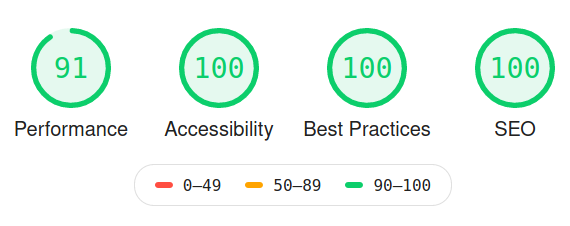
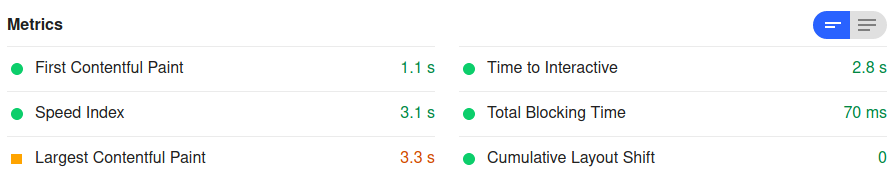

# Biolia theme for Shopaholic
## Overview

_Biolia_ is customizable and mobile-friendly e-commerce theme for [Shopaholic](https://octobercms.com/plugin/lovata-shopaholic) designed especially for a stylish organic food & eco products Store (but can be used for any kind of online shops). It provides nice and light UI with a high performance of the front-end (87-100 points by Lighthouse benchmark).

## Key concepts

* [Responsive Web Design](https://developers.google.com/search/mobile-sites/mobile-seo/responsive-design)
* [Mobile first approach](https://developers.google.com/search/mobile-sites/mobile-first-indexing)
* [BEM naming](https://en.bem.info/methodology/naming-convention/)
* [Structured data](https://developers.google.com/search/docs/guides/sd-policies)
* [WCAG 2.1 Level A conformance](https://www.w3.org/TR/WCAG20/#conformance) 

## Main features

* Catalog filtering & sorting
* Catalog full-text search
* Product nutrition facts infographics
* Blog
* Customer wish list
* Discount coupons
* SEO management

## Additional features

* Online payments support
* Extra discounting and advertising options

## Theme settings

* Shop branding
* Contacts credentials
* Predefined text blocks
* Search options
* Payment options
* Delivery options
* Social media links
* Promo carousel on the Index page

## Performance




Key pages audits reports:

| Page             | Performance   | Accessibility  | Best practices | SEO  |
| ---------------: | ------------: | -------------: | -------------: | ---: |
| [Index](https://lighthouse-dot-webdotdevsite.appspot.com//lh/html?url=https://biolia.shopaholic.dev/)*            |            91 |            100 |            100 |  100 |
| [Catalog](https://lighthouse-dot-webdotdevsite.appspot.com//lh/html?url=https://biolia.shopaholic.dev/catalog) |            87 |             100 |            100 |  100 |
| [Catalog category](https://lighthouse-dot-webdotdevsite.appspot.com//lh/html?url=https://biolia.shopaholic.dev/catalog/fruits) |            87 |             100 |            100 |  100 |
| [Product](https://lighthouse-dot-webdotdevsite.appspot.com//lh/html?url=https://biolia.shopaholic.dev/catalog/fruits/apricot-0)          |            87 |            100 |            100 |  100 |
| [News](https://lighthouse-dot-webdotdevsite.appspot.com//lh/html?url=https://biolia.shopaholic.dev/news)             |            91 |            100 |            100 |  100 |
| [Post](https://lighthouse-dot-webdotdevsite.appspot.com//lh/html?url=https://biolia.shopaholic.dev/news/10-proven-benefits-olive-oil)             |            98 |            100 |            100 |  100 |

_*[Instagram Feed](https://octobercms.com/plugin/artdark-instagram) plugin has been disabled._

## Browser support

Theme is compatible with two recent desktop versions of:
* Chrome
* Edge
* Firefox
* Opera
* Safari

and two recent mobile versions of:
* Chrome
* Safari

The [Browserlist](https://github.com/browserslist/browserslist) config is provided.

> Please note, we support only fresh browsers to keep theme code clean and provide high performance.

## Development

Front-end tools are provided with the theme. So you can customize it following the needs of your projects.

Front-end tools list:
* [Laravel Mix](https://laravel.com/docs/5.8/mix) (Webpack)
* [stylelint](https://stylelint.io)
* [ESLint](https://eslint.org)
* [Browserlist](https://github.com/browserslist/browserslist)
* [Babel](https://babeljs.io)
* [husky](https://github.com/typicode/husky)
* [PostCSS](https://postcss.org)
* [Autoprefixer](https://github.com/postcss/autoprefixer)

### Get started

1. Copy the contents of the folder `build` to the root of your project.
2. Run `npm i`.
3. Run `npm run watch`.
4. Make your changes to the source code.
<!-- TODO: Add the list of the front-end dependencies -->

### Complete list of available NPM commands

```bash

# Main commands

npm run watch       # Run `npm run development` in watching mode
npm run watch-poll  # Use it in case `npm run watch` doesn't update opened page
npm run development # Build dist for the dev environment
npm run production  # Build dist for the prod environment (minified source code)
npm run lint:css    # Lint & autofix CSS code following the config
npm run lint:js     # Lint & autofix JS code following the config


# Shortcuts

npm run dev         # Alias for `npm run development`
npm run prod        # Alias for Run `npm run production`
```

## Code quality

We ensure the high quality of our products and provide you with full support. All of our products have extensive documentation. The quality of our products goes through rigorous testing, we have launched automated testing for all of our plugins. Our code conforms with the best writing and structuring practices. All this guarantees the stable work of our products after they are updated with new functionality and ensures their smooth integration.

## License

© 2020, LOVATA Group, LLC under [Regular](https://octobercms.com/help/license/regular) or [Extended](https://octobercms.com/help/license/extended) marketplace license.
